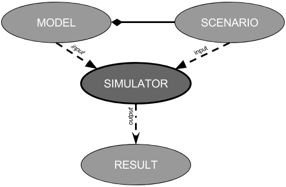

```{r setup, include=FALSE}
knitr::opts_chunk$set(echo = TRUE)
```

## Introduction

The application presented herein was developed as a companion application to the R package sdsim [@SDSIM]. It was developed to facilitate the implementation and simulation of system dynamics models, introduced by @FORRESTER. It was developed in R [@RCoreTeam], using the shiny web application framework[@SHINY], and it presents a didactic and intuitive environment for developing, simulating and sharing system dynamics models.
The application uses the model structure from the sdsim package [@SDSIM], which encapsulates the models into self-contained objects, which can be simulated separately, or coupled with other models.

<center>

{width=400px}

</center>

- about sdsim, desolve
- Supported models
- Scenario
- Results
- about interface (explanation, example picture)
  -model examples

# Example Using the Application

# Model
In a modeling and simulation context, a model is conceived as mathematical representation of a system. It is a set of instructions, rules, equations, or constraints for generating input/output behavior . This application supports three types of models: ODE models, static models and coupled models.
## Loading Models
## Saving Models
## Creating Models
### ODE Models
### Static Models
### Coupled Models
## Circular dependency in equations?
## Example Models
## Switching Models
## Cloning Models
## Changing Model IDs

# Scenario
A scenario contains the variables and values that describe the environment in which a system is embedded.
## Loading Scenarios
## saving Scenarios
## Creating Scenarios
## Switching Scenarios
## Changing Scenario IDs

# Simulating Models
## Simulation Results
## Exporting Results
### Plotting Results
### Exporting Plots

# Performance

# Conclusion