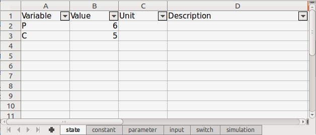

# Main Features of sdsim

The sdsim package written in the R programming language [@RCoreTeam] was developed to facilitate the prototyping of system dynamics models introduced by @FORRESTER and, with a wrapper around the **ode** solver from the deSolve Package [@deSolve], to solve initial value problems of ordinary differential equations (ODE). 

The package defines an easy-to-learn structure that encapsulates in self-contained objects the mathematical equations and the environment variables of a system. The model and simulation composability [@composability] achieved with the generalized structure proposed by the sdsim package confers flexibility to assemble and reuse objects, as illustrated in the following image.

<center>

{width=400px}

</center>


* The package sdsim supports atomic models of ODE, static models of algebraic equations and the coupling of any class of model that make it possible, in a innovative way, to represent a more complex system with communication between its components [@ZEIGLER]. To facilitate debug all the models have a structure verifying method [@validation] that warn the user about any implementation error found in the equations evaluation in the time sequence first step.
* Through an object oriented approach the package encapsulates all the equations and functions that defines a model in a single object, which also contains a scenario object to store all the data, variables and values, that defines the model default environment. The sdsim classes were implemented using the R package R6[@R6], using inheritance (superclass) between the models to allow approaching new paradigms and with support to active binding to allow a simple access and assignment of the objects fields. The package export factory functions to facilitate the instantiation of objects, which can be saved in an Extensible Markup Language (XML) [@XML] for structured documentation that is easy to share and reuse.
* The scenario was implemented as an independent object to make it possible to use different assumptions and get different forecasts for the same model object. This confers the flexibility to adapt of the sdsim composable model structure, which allows the same model to be reused with different scenarios in distinct simulations.
* The simulation result is stored in an output object with visualization methods, both graphical and summarized, to help in the analysis of the results. The simulation output can be saved together with the model and scenario that generated it, ensuring reproducibility.
* To make the package usable for different users background a graphical user interface (GUI) application was developed with the shiny web application framework [@SHINY]. All the package functionalities are available in the sdsim web application, facilitating familiarization with the package structure without being limited by a more advance knowledge of the R programming language.
* The sdsim package have a repository with ready-to-use model examples that are exported to serve as first use cases of the package. Through a load function or the web application any model in the sdsim repository can be accessed.

# Use Cases

## Example Using sdsim

The model of the Lotka-Volterra equations presented in the deSolve package [@deSolve] will be implemented here using the package sdsim structure. This model consist of a population of preys and a population of consumers coexisting in the same environment.

The Lotka-Volterra Model is defined by the following equations:

$$dP    = growthP - ingestC$$
$$dC    = ingestC * AE - mortC$$

Where *dP* is the rate of change in the prey population and *dC* is the rate of change in the consumer population. The *growthP*, *ingestC* and *mortC* are auxiliary equations that simplify, help to compute the derivatives values and also store useful information about the system behaviour. The auxiliary equations are defined as:

$$ingestC = rI * P * C$$
$$capacityRegulation = 1 - P/K$$
$$growthP = rG * P * capacityRegulation$$
$$mortC   =  rM * C$$

Where *ingestC* is the amount of food ingested by the consumer, *capacityRegulation* is the available rate of the environment capacity, *growthP* is the prey growth quantity and *mortC* is the consumer mortality quantity.

### Implementing an Atomic System Dynamics Model

The sdsim atomic system dynamics model class named *sdAtomicModelClass* have the following fields that can be passed to the factory function:

- *id*: a string with a valid name for the model identification, uses the function *make.names* [@RCoreTeam] to make syntactically valid names.
- *description*: a string with a breath description of the model.
- *defaultScenario*: The model default scenario object. It should contain all the model variables initialized with default values that ensures the model simulation and exemplifies its behaviour.
- *aux*: A list with the model auxiliary equations in strings or R-expressions written in R-format to assist in the *DifferentialEquations* computation.
- *DifferentialEquations*: An R-function that computes the values of the state variables derivatives in the ODE system (the model definition) at each time step of the simulation.
- *InitVars*: An R-function that initialize or change the initial state values and/or other model variables before the solver call when running a simulation. It can be used, for example, to compute some dependent parameter variables or the initial state values.
- *PostProcessVars*: An R-function that receives the simulation output trajectories inside the simulator function and process it to derive further conclusions.
- *RootSpecification*: A numeric vector containing the times to trigger an event, or a *data.frame* specifying the events, or an R-function that becomes zero when an event occur.
- *EventFunction*: An R-function that specifies the event.
- *globalFunctions*: A named list of extra functions that can be executed in the scope of any other function or auxiliary equation defined in the model.

To define the example model we need a scenario object, a function to compute the derivatives of the ODE system and a list of auxiliary equations to help in this computation.

We will begin creating the scenario that represents an environment for the Lotka-Volterra model. This model have two type of variables, the initial state of the system and the parameters, with descriptions and units. The scenario also stores some simulation configurations, the time sequence and the integrator method. The following chunk of code initialize the default scenario for this model.

```{r LVscenario, cache=TRUE}
library(sdsim)

# create the lists of variables
state      <- list(P = 1,
                   C = 2)
parameters <- list(rI = 0.2,    
                   rG = 1.0,    
                   rM = 0.2 ,   
                   AE = 0.5,   
                   K  = 10)     
descriptions <- list(P = "population of preys",
                     C = "population of consumers",
                     rI = "rate of ingestion",    
                     rG = "growth rate of prey",   
                     rM = "mortality rate of consumer" ,   
                     AE = "assimilation efficiency",    
                     K  = "carrying capacity")
units   <- list(P = "mmol",
                C = "mmol",
                rI = "1/day",    
                rG = "1/day",   
                rM = "1/day" ,   
                AE = "dimensionless",    
                K  = "mmol/m^3")
times   <- list(from = 0,
                to = 200,
                by = 1)
method  <- "lsoda"

# call the scenario factory to create an object
lvScenario <- sdScenario(id = "LVScenario",
                         state = state,
                         parameter = parameters,
                         times = times,
                         method = method,
                         description = descriptions,
                         unit = units)
print(lvScenario)
```

Next we will create the auxiliary equations and the *differentialEquation* function. This function must be defined as follow.

> function(t, st, ct, par, inp, sw, aux)

Where:

- *t*: is the current time point in the integration;
- *st*: is a list with the current estimative of the state variables in the ODE system;
- *ct*: is a list with the model scenario constant variables;
- *par*: is a list with the model scenario parameter variables;
- *inp*: is a list with the model scenario input variables, it should include any exougenous source such as time series;
- *sw*: is  list with the model scenario switch variables and;
- *aux*: is a list with the model auxiliary equations evaluated for the current time step (t).
- *return value*: a list, whose first element is a vector containing the derivatives of the state variables with respect to time, as defined by the **ode** function.

These arguments are also available for the auxiliary equations definition using a list of strings or expressions which will be evaluated at each time step before the *differentialEquation* function call.

The model is defined as follow.

```{r LVModel, dependson=c(-1), cache=TRUE}
aux <- list(ingestC = "par$rI * st$P * st$C",
            growthP = "par$rG * st$P * (1 - st$P/par$K)",
            "mortC <- par$rM * st$C")
LVode <- function(t, st, ct, par, inp, sw, aux)
{
  dP    <- aux$growthP - aux$ingestC
  dC    <- aux$ingestC * par$AE - aux$mortC
  
  return(list(c(dP, dC)))
}

lv <- sdAtomicModel(id = "LotkaVolterra",
              defaultScenario = lvScenario,
              DifferentialEquations = LVode,
              aux = aux)
print(lv)
```

With the Lotka-Volterra model object initialized we can verify its equations using the appropriate object method and then safely execute the simulation. This is done in the next chunk of code and the last ten lines of the outputted simulation trajectories are shown in a short print of the result object with the simulation diagnostics.

```{r LVsimulation, dependson=c(-1), cache=TRUE}
lv$verifyModel(verbose = TRUE)

outlv <- sdSimulate(model = lv)
print(outlv)
```

The simulation output object has visualization methods to help analyze the model results. We are going to plot the state variables trajectories in the same y-axis to show the two populations co-existing in the same environment and reaching equilibrium. Any variable present in the outputted trajectories could be plotted, including the auxiliaries.

```{r LVoutput, fig.width=6, fig.height=4, fig.align='center', dependson=c(-1)}
outlv$plot("P C",
           main = "Populations of Prey and Consumer",
           multipleYAxis = TRUE)
```

Through the object methods the output result could also be summarized and the trajectories fully printed for more accurate tabular visualization.

### sdsim Performance

Using the package *microbenchmark* [@microbenchmark] the performance of the Lotka-Volterra model implemented here was compared with the original implementation by the deSolve package. The simulation time elapse of the two implementations in a computer with 7.7 GiB of RAM memory and processor Intel® Core™ i7 CPU 870 @ 2.93GHz × 8 are compared in the following table.


| Package | Median | Unit |
|:----:|-------:|:----:|
|deSolve |  19.80 |  ms  |
| sdsim  |  23.20 | ms   |  


By means of a closure function the sdsim package is capable of memoizing the model fixed variables and pre evaluating the time series and auxiliary equations before the *differentialEquation* function call. These extra calculations during the simulations combined with the previous manipulation of the package data structure to fit in the deSolve format confers an overhead of less than 20% to the sdsim simulator when compared to a model implemented directly in the deSolve package.

Even though this overhead means loss of efficiency the sdsim package compensates it with the gain in usability and ease in the implementation and simulation of systems dynamics.

### Implementing a Static Model

A static model calculates the system in equilibrium, and thus is time-invariant. The sdsim static (or steady-state, no state variables) object model consists of algebraic equations and a default scenario describing the system environment (variables and values). In this definition a static model provides the system response to a specific set of input conditions. If there is no exogenous source input, such as a time series or results from a dynamic model, the evaluation of the algebraic equations will be constant.

The following variables are available in the algebraic equations evaluation:

- t: is the current time point in the integration;
- ct: is a list with the model constant variables;
- par: is a list with the model parameter variables;
- inp: is a list with the model input variables and any time series variables;
- sw: is list with the model switch variables and;
- eq: is a list with the predecessors algebraic equations, following the sorted list, already evaluated for the current time step.

To exemplify the use of this type of model the environment that helds the population of preys of the Lotka-Volterra model example represented by the *capacityRegulation* auxiliary equation is going to be isolated in the following algebraic equation.

$$capacityRegulation = "1 - P/K"$$

Where *P* is the population size and *K* is the environment carrying capacity, e.g. the maximum population size supported by the environment. The *capacityRegulation* is the available fraction of the environment capacity, which is used to regulate the population growth.

The next chunk of code creates the environment static model and simulates it for the initial population of preys from the Lotka-Volterra example.

```{r staticExample, cache=TRUE}
# define the parameters: the environment carrying capacity
parEnv <- data.frame(Variable = c("K"),
                     Value = c(10),
                     Description = c("carrying capacity"),
                     stringsAsFactors = FALSE)

# define the input: the population size
inpEnv <- data.frame(Variable = c("P"),
                     Value = c(1),
                     Description = c("Population size"),
                     stringsAsFactors = FALSE)

# define the algebraic equation that regulates the environment capacity
eqEnvironment <- list(capacityRegulation = "1 - inp$P/par$K")

# creates the environment scenario
envScen <- sdScenario(id = "EnvironmentScen",
                      parameter = parEnv,
                      input = inpEnv,
                      times = list(from = 0, to = 200, by = 1))

# create the static model of the environment
environmentLV <- sdStaticModel(id = "Environment",
                               defaultScenario = envScen,
                               algebraicEquations = eqEnvironment)

# simulates the static model and print the algebraic equation evaluation
outenv <- sdSimulate(model = environmentLV)
print(outenv)
```

The result show that 90% of the environment is still available for population growth in the initial time of the given scenario.

# Creating Scenarios

A scenario represents the variables and values that constitute a system environment [@scenario], and that are used to compute the equations of a model. It also stores configurations for a simulation, e.g. the time sequence and the integrator method. 

The sdsim models have a default scenario to store all the system variables that need to be measured and that should be initialized with default values to ensure a simulation. The default scenario serve as a use case of the model and should exemplify its behaviour. The package composability specification allow the combination of a model with a range of scenarios of interest in different simulations, these given scenarios overwrite the values of the model default scenario variables to represent each different aimed purpose and observation (see example in the following subsection [Using Excel Files]).

The sdsim package defines a scenario through the following type of variables:

- state: The default initial state values for the ODE system. The state variables are used to describe the mathematical "state" of a dynamic system. The continuous rate of change of these variables is determined by the model *DifferentialEquations* function. Not present in static models.
- constant: The model constant values that are immutable between simulations and inaccessible for statistical calibration.
- parameter: The model parameters that are only constant during one simulation.
- input: The model inputs that are exogenous variables, such as coupled or time series variables.
- switch: The model switches that assists in any kind of selection.

The scenario elements notation were organized by types to make it easier to determine each variable role in a system of interest. The understandability of a model can be increased when the modeler makes use of these different types of variables to define how each variable behave, influence and fit into a system. The learnability of a shared model can be eased if one can visualize just by looking to the system equations what each variable represent and how they interact to generate the behavior of the system dynamics being studied.

There are four possible ways of defining a scenario in the sdsim package: (1) using *lists*; (2) using the object methods; (3) using *data.frames*; or (4) using an Excel file. The first way was demonstrated in the previous example and simple consist of passing to the factory function a named list for each type of variable, including the descriptions and units. The other three ways will be described in the next subsections by redefining the default scenario of the Lotka-Volterra example.

## Using Object Methods

The variables of a scenario can be added iteratively by calling the *add* method of a scenario object for each type of variable or by simple assigning a list with the variables directly to the object field.

The following chunk of code creates an empty scenario object and then adds the Lotka-Volterra initial state variables using the object method *addState* and their descriptions using the method *addDescription*, adds the parameters and the integrator method using the assignment operator and finally set the time sequence using the assignment operator and the method *setTimeSequence*.

```{r scenMethods}
# creates an empty scenario object
lvScenario <- sdScenario(id = "LVScenario")

# add the state variables and their descriptions
lvScenario$addState(P = 1, C = 2)
lvScenario$addDescription(P = "population of preys", C = "population of consumers")

# add the parameter variables
lvScenario$parameter <- list(rI = 0.2,    
                             rG = 1.0,    
                             rM = 0.2 ,   
                             AE = 0.5,   
                             K  = 10)
# set the integrator method (optional, could use the default)
lvScenario$method <- "lsoda"

# set the time sequence using the two possible ways
lvScenario$times <- list(from = 0, to = 200)
lvScenario$setTimeSequence(by = 1)

print(lvScenario)
```

The scenario fields are implemented as an active binding [@RCoreTeam], meaning that they are associated with a function but are accessed as common items. This way the package enforces valid assignment to the object fields.

## Using *Data.frames*

The *data.frame* format encapsulates in a single data structure the names, values, descriptions and units for each type of variable. It must have a header and each new row defines a different variable. The following table exemplifies the variables *data.frame* format.


| Variable | Value | Unit | Description |
|:------:|:-------:|:----:|:----:|
| varName |  1.0 |  dimensionless  | brief description of var | 


The only exception is the *input* type that should also contain a fifth column, labeled 'Interpolation' containing the interpolation method to be used in case of time series variables. The default decimal point character is '.' and all the leading and trailing whitespaces will be trimmed. All the *data.frames* headers must have the same names, if they are different from the defaults they must be informed via the constructor arguments.

The following chunk of code reset the Lotka Volterra scenario using *data.frames*, which is only possible through the constructor or factory function. To retrieve the scenario variables as *data.frames* use the method *scenarioDataFrames*.

```{r LVscenarioDF}
library(sdsim)

state      <- data.frame(Variable = c("P", "C"),
                         Value = c(1, 2),
                         Description = c("Prey", "Consumer"),
                         stringsAsFactors = FALSE)
parameters <- data.frame(Variable = c("rI", "rG", "rM", "AE", "K"),
                         Value = c(0.2, 1, 0.2, 0.5, 10),
                         Unit = c("1/day", "1/day", "1/day", "dimensionless", "mmol/m^3"),
                         Description = c("rate of ingestion", "growth rate of prey",
                                         "mortality rate of consumer",  
                                         "assimilation efficiency", "carrying capacity"),
                         stringsAsFactors = FALSE)


times   <- list(from = 0,
                to = 200,
                by = 1)
method  <- "lsoda"

# call the scenario factory
lvScenario <- sdScenario(id = "LVScenario",
                         state = state,
                         parameter = parameters,
                         times = times,
                         method = method)
lvScenario$buildDataFrames()
```

Remember setting *stringsAsFactor = FALSE* when creating *data.frames* to prevent wrong conversion. Empty variable names and invalid values will be skipped with a warning to the user.

## Using Excel Files

The Excel format is recommend for manually editing a scenario. It can be manipulated from a graphical user interface, eliminating the need to deal with a data structure in R code. The Excel file representing a scenario must have one sheet per type of variable and a sheet for the simulation configurations. The sheets expected names are: *state*, *constant*, *input*, *parameter*, *switch* and *simulation*; when using different sheet names they must be informed via the constructor arguments. A sheet can be missing if the scenario do not have the corresponding type of variable.

Each Excel sheet must follow the *data.frames* guidelines (e.g. header, columns and rows) with exception to the *simulation* sheet that can only have the following 5 (five) hard coded variables.


| Variable | Value | Unit | Description |
|:------:|:-------:|:----:|:----:|
| **id** | LVScenario |    |  |
| **from** | 0 |  days  | simulation time sequence |
| **to** | 200 |    | |
| **by** | 1 |    | |
| **method** | lsoda |    | the name of a deSolve integrador method|


The following chunk of code creates an Excel file template ready for edition.

```{r scenExcel}
sdExcelTemplate(file = "LVscenario.xlsx")
```

To exemplify, we are going to open the Excel file and create two state variables *P* and *C* with values 6 and 5, respectively. The new excel file should look like the image bellow.


<center>

{width=350px}

</center>


With the sdsim load function we are going to reload the modified Excel file to the current working space and run a new simulation with it, as coded bellow.

```{r scenChange,  echo=FALSE, cache=T}
lvScenario <- sdLoadScenario(file = "LVscenario.xlsx")

lvScenario$state <- list(P = 6, C = 5)
lvScenario$saveXlsx(file = "LVscenario.xlsx")
```


```{r scenLoad, fig.width=6, fig.height=4, fig.align='center',dependson=c("LVModel")}
lvScenario <- sdLoadScenario(file = "LVscenario.xlsx")
outlv <- sdSimulate(model = lv, scenario = lvScenario)

outlv$plot("P C",
           main = "Populations of Prey and Consumer",
           multipleYAxis = TRUE)
```

The scenarios of interest passed to the simulator function along with a model should not contain all the variables that compose the model default scenario. Instead it should contain only the variables of need to the analysis, guaranteeing that the computation time will be spent updating only the necessary variables without modifying others that will keep their default values.

In the example above all the sheets except the *state* sheet could be deleted from the Excel file to save some computation time since they were not modified and the default values were still used.

# Exploring the Output Visualization

The sdsim simulation output object obtained with the sdsim simulator function contains the output trajectory, the auxiliary equations trajectory, the input time series variables trajectory, the simulation diagnostics and the model *postProcess* function return value.

It has methods for saving the output with the model and scenario that generated it, for plotting the stored trajectories and also for summarizing them.

The output plot can automatically show all the output trajectory variables in separate charts or be personalized with a character formula to indicate the variables trajectories to be used and combined in each chart axis to suit the user analysis.

The sdsim plot formula follow the standard:

> "y ~ x"

Where:

- **y** is a list of strings separated by a white space with the variables names to be plotted in the y-axis;
- **~** is the separator to be used in the formulas when **x** is not missing;
- **x** is the name of the variable to be plotted in the x-axis. If missing the simulation time sequence will be used by default.

The **y** and **x** terms accepts any variable name present in the trajectories. For the Lotka-Volterra model these terms could assume any of the following values: *P*, *C*, *ingestC*, *growthP* or *mortC*, and the **y** term could also assume a combination of them.

The following character formulas are valid for plotting the Lotka-Volterra model trajectories:

- "ingestC growthP": will plot the *ingestC* and the *growthP* auxiliary equations trajectories in the y-axis and the time sequence in the x-axis
- "growthP ~ mortC": will plot the *growthP* auxiliary equation trajectory the y-axis and the *mortC* auxiliary equation trajectory in the x-axis.

The logical argument *multipleYAxis* adds a different y-axis for each y-variable present in the formula. The logical argument *units* adds to the axis labels the variables units present in the model default scenario.

If more than one formula is passed to the plot method at once the plots are going to be organized in panels with *maxCol* being the number of columns and *maxRow* the number of rows.

# Coupling Models

In real life as well as in nature there is no isolated system, specific formalisms are used to model the behaviour of a component atomically and to separate it from the whole complex system interactions [@complexSys, @composability]. In some cases the communication between systems are the focus of the study and modeling a complex system without discriminating it's components can result in the loss of information or the lack of understanding the real problem.

In this context appears the need to construct a coupled model with interactions between its components. The sdsim package is the first framework to approach this problem in R, through an object-oriented structure it allows the definition of a more complex systems with diversity in its different components.

In the sdsim package a coupled model object is made up of atomic system dynamics, static and/or other coupled models components and a list of connections that define the flow of information between them. The connection list determines loops of information feedback and circular causality for conceptualizing the behaviour of the overall system and for communicating model-based insights. The complex system is solved by integrating all the coupled system components simultaneously as one, updating the connections at each time step.

The connections in the package can only be made from a *state* variable, an *auxiliary* equation or an *algebraic* equation to an *input* variable. At each time step the respective *input* variable receives the proper variable or equation value, ensuring synchronization between components.

The sdsim defines a connection with a character vector of five elements as follow.

> c(ID, Component 1, Input 1, Component 2, Output 2)

- ID: the connection identification;
- Component 1: the identification of the receiver component, as defined in the model object;
- Input 1: the name of the input variable from the receiver component (component 1);
- Component 2: the identification of the sender component, as defined in the model object;
- Output 2: the name of the connected state variable or, auxiliary or algebraic, equation with prefix st\$, aux\$ or eq\$, respectively, indicating the output type from the sender component (component 2), e.g. st\$\<varName\>, aux\$\<eqName\> or eq\$\<eqName\>.

Knowing how to define the components and the connections is sufficient to create a coupled model, its composability structure allows the reuse of components to compose a complex systems [@componentBased]. 

The coupling is done automatically by an object method that builds all the auxiliary data structures to be used in the simulations. This build consist of creating the default coupled scenario by merging the components default scenarios (see the [Building a Coupled Scenario] section), using regular expressions to update the components equations with the name of the coupled scenario variables, initializing the coupled auxiliary and/or algebraic equations, creating the vectors to represent the connections and a list with the components variables indexes. The components identification must be unique and will be used to discriminate them in the coupling.

If the components have support to events and no component defined an event function the simulation will stop in the first trigger, otherwise the corresponding event function will be triggered.

Building the coupled model before executing the simulation will save some computation time and guarantee the model correctness when used together with the validation method.

## Implementing a Coupled Model

To exemplify the implementation of a coupled model the Lotka-Volterra example is going to be disaggregated into three components: (1) the prey; (2) the consumer; and (3) the environment models. The models (1) and (2) are atomic and the model (3) is static and was already implemented in the previous example (see [Implementing a Static Model]).

The atomic components are going to be defined by the following equations.

Prey:

$$growthP = par\$rG * st\$P * inp\$envCapacity$$
$$dP    = aux\$growthP - inp\$ingestC$$

Where the inputs *envCapacity* will come from the environment static model and the *ingestC* will come from the consumer model.

Consumer:

$$ingestC = par\$rI * inp\$P * st\$C$$
$$mortC = par\$rM * st\$C$$
$$dC = aux\$ingestC * par\$aE - aux\$mortC$$

Where the input *P* will come from the prey model and will also be sent to the environment model.

The following connections will define these communications between components.

> c("conP", "Consumer", "P", "Prey", "st$P")

> c("conIngestC", "Prey", "ingestC", "Consumer", "aux$ingestC")

> c("conPEnv", "Environment", "P", "Prey", "st$P")

> c("conEnvCapacity", "Prey", "envCapacity", "Environment", "eq$capacityRegulation")

Where,

- conP: inform the consumer model about the amount of preys;
- conIngestC: inform the prey model about the consumer ingestion;
- conPEnv: inform the environment model about the amount of preys; and
- conEnvCapacity: inform the prey model about the available environment capacity rate

With the given equations and the list of connections the coupled model can be created and build as follow.


```{r coupledExe, dependson=c("staticExample"), cache=TRUE}
# define the time sequence and use the default method
times <- list(from = 0, to = 200, by = 1)

# Prey model variables and ODE function
stPrey <- list(P = 1)
parsPrey      <- list(rG = 1.0)
inpPrey <- list(ingestC = 0,
                envCapacity = 1)
auxPrey <- list(growthP = "par$rG * st$P * inp$envCapacity")

LVodePrey <- function(t, st, ct, par, inp, sw, aux)
{
  dP    <- aux$growthP - inp$ingestC
  
  return(list(c(dP)))
}

# create the component prey model
prey <- sdAtomicModel(id = "Prey",
                defaultScenario = sdScenario(id = "preyScen",
                                             times = times,
                                             state = stPrey,
                                             parameter = parsPrey,
                                             input = inpPrey),
                aux = auxPrey,
                DifferentialEquations = LVodePrey)

# Consumer model variables and ODE function
stConsumer <- list(C = 2)
parsConsumer  <- list(rI = 0.2,
                      rM = 0.2 ,   
                      aE = 0.5)
inpConsumer <- list(P = 0)
auxConsumer <- list(ingestC = "par$rI * inp$P * st$C",
                    "mortC <- par$rM * st$C")

LVodeConsumer <- function(t, st, ct, par, inp, sw, aux)
{
  dC    <- aux$ingestC * par$aE - aux$mortC
  
  return(list(c(dC)))
}

# create the component consumer model
consumer <- sdAtomicModel(id = "Consumer",
                    defaultScenario = sdScenario(id = "consumerScen",
                                                 times = times,
                                                 state = stConsumer,
                                                 parameter = parsConsumer,
                                                 input = inpConsumer),
                    aux = auxConsumer,
                    DifferentialEquations = LVodeConsumer)

# create the coupled model connections list
lvConnections <- list(c("conP", "Consumer", "P", "Prey", "st$P"),
                      c("conIngestC", "Prey", "ingestC", "Consumer", "aux$ingestC"),
                      c("conPEnv", "Environment", "P", "Prey", "st$P"),
                      c("conEnvCapacity", "Prey", "envCapacity", "Environment", "eq$capacityRegulation"))

# create the coupled model
coupledLV <- sdCoupledModel(id = "LVCoupled",
                            components = c(prey, consumer, environmentLV),
                            connections = lvConnections,
                            "Lotka-Volterra Equations implemented as a coupled model")

# build the coupled model and print it
coupledLV$buildCoupledModel(from = 0,
                            to = 200,
                            by = 1)
print(coupledLV)
```

The instantiated coupled model need to be validated to assure that the coupling was correctly built. Then the model can be simulated and the results plotted as follow.

```{r coupledSim, fig.width=6, fig.height=8, fig.align='center', dependson=-1, cache=TRUE, autodep=TRUE}
# validate the coupled model
coupledLV$verifyModel(verbose = T)

# simulate the coupled model and plot the results
outclv <- sdSimulate(coupledLV)
outclv$plot("Prey.P Consumer.C", "Prey.P Environment.capacityRegulation",
            main = c("Coupled Prey and Consumer Population by Lotka-Volterra",
                     "Coupled Prey Population Regulated by the Environment Capacity"),
            maxCol = 1,
            multipleYAxis = T)
```

As expected the populations trajectories are equal to the simulation of the atomic model implementation example.

Through vectorization the results of the components evaluations are automatically concatenated at each simulation time step by the package simulator function, ensuring that the complex system is integrated as a single model. These extra data manipulation and the established connections add an overhead of about 50% when compared to an atomic model implementation.

The following table compares the time elapse of the Lotka-Volterra model example implemented with the sdsim package and obtained with the microbenchmark package timing in the same computer as the previous performance comparison.


| Model Details | Median | Unit |
|:-----------------------------------:|-------:|:----:|
|Atomic Lotka-Volterra |  23.20 |  ms  |
|Coupled Lotka-Volterra with 1 component (the atomic model)  and no connections|  33.30 | ms   |
|Coupled Lotka-Volterra with 3 components and 4 connections |  42.45 | ms   |


## Building a Coupled Scenario

The sdsim package exports a function to build additional coupled scenarios. This function merges a named list of scenario objects in to a unique coupled scenario object with all the variables named with the prefix 'id.' followed by the original variable name. The 'id' is the name of each element in the scenarios list and must be the same name of the component identification that will use it. Use the arguments to define the coupled scenario simulation time sequence (the arguments *from*, *to* and *by* must be present to define the time sequence) and the integrator method to be used in the simulations (or the default *lsoda* will be used).

The next chunk of code creates a coupled scenario for the Lotka-Volterra example.

```{r coupledScen}
# creates a scenario for the prey model
preyScen <- sdScenario(id = "coupledPreyScen",
                       state = list(P = 5))

# creates a scenario for the consumer model
consumerScen <- sdScenario(id = "coupledConsumerScen",
                           state = list(C = 6))

# creates a scenario for the environment model
environmentScen <- sdScenario(id = "coupledEnvScen",
                              parameter = list(K = 15))

# creates the coupled scenario
coupledLvScen <- sdBuildCoupledScenario(scenarios = list(Prey = preyScen,
                                                         Consumer = consumerScen,
                                                         Environment = environmentScen),
                                        from = 0, to = 200, by = 1,
                                        method = "lsoda")

print(coupledLvScen)
```

Now a new simulation of the coupled Lotka-Volterra model is executed with the just created coupled scenario.

```{r coupledLVsimScen, fig.width=6, fig.height=4, fig.align='center', dependson=c(-1,"coupledExe")}
# execute the simulation in the given scenario and plot the result
outclvScen <- sdSimulate(model = coupledLV, scenario = coupledLvScen)

outclvScen$plot("Prey.P Consumer.C",
                main = "Coupled Prey and Consumer Population by Lotka-Volterra",
                multipleYAxis = T)
```

# Circular Dependency in the Equations

The package sdsim initializes the algebraic and auxiliary equations from a list of strings or R-expressions with the equations in R-format and sort the equations using their interdependencies to enable the reuse of evaluated equations in other equations further in the list.

If any circular dependency among equations is found the equations initialization is aborted and a warning is sent to the user. Each equation will be an element of the returned sorted list in R-expression format. The R-base *eval* [@RCoreTeam] function is used to evaluate each R-expression in a specified environment. 

In the following example the equation *cDiffFrac* depends on the equation *kDiff*, meaning that the last must come first in the sorted list.

```{r aux}
const = list(c1 = 2, c2 = 1)
vars = list(k1 = 10, k2 = 2)

auxEquationsStrings <- list("cDiffFrac <- (const$c1 - const$c2) / aux$kDiff",
                            kDiff = "vars$k1 - vars$k2")
aux <- sdInitEquations(auxEquationsStrings, eqName = 'aux')

print(aux)

# evaluate the auxiliary equations list
for (i in seq_along(aux))
  aux[[i]] <- eval(aux[[i]])
print(aux)
```

In the package it is hard coded that the auxiliary equations will be stored in a list named *aux* and that the algebraic equations will be stored in a list named *eq*. These names are used in regular expressions to determine each equation dependency and then a topological sort is executed to guarantee the correct evaluation of the list in the outputed order.

These is particularly useful when simulating coupled models to prevent a connection from using an unevaluated expression.

# Further Examples

The next sections explore more functionalities of the sdsim package. In the future, similar to the sdsim simulator new functions can be created to aggregate extra data methods to the package, such as calibration, otimization, filtering and any other analise [@dataMethods] that will manipulate the data structure of the package to derive conclusions. 

## sdsim Repository

The sdsim repository examples consist of simple atomic models taken from the books of @Duggan and @DiffEqR, and implemented using the package structure. The models were saved in XML files and through the package load function with the logical argument *repository* set to *TRUE* they can be retrieved.

The available list of models stored in the repository list can be printed with the following function.

```{r rep}
# show the sdsim repository models identification
sdRepository()
```

The function *sdLoadModel* will be used in the following sections to retrieve a model from the sdsim repository.

## Using Temporal Functions

Time series variables are input variables that vary over time, e.g. a diet that change after a period of time, meteorological data, etc. The package sdsim exports the function *sdTemporalFunction* to perform the interpolation of time series data points with extrapolation outside of the time interval. This function is a wrapper around the *approxfun* and the *splinefun* functions from the stats package [@RCoreTeam] that perform, respectively, the linear and cubic interpolation of data points.

This function is automatically used by the scenario class to transform any input time series variable into a temporal function, also called forcing function. To make this transformation happen a list with the interpolation methods named with the respective input variable name must be passed to the scenario factory function or to the *add* method via the argument *interpolation*. When an interpolation is informed it is stored in the *interpolation_* element of the input list and the respective time series variable is transformed into a unary function of time that is stored in the element *fun_* also in the input list. If the transformation fails the method will not be stored.

The input time series variables accepts as valid values a:

- fixed value: The fixed value is repeated for every time step.
- matrix or *data.frame*: Should have two columns, the first column must contain the time sequence and the second column must contain the values for each given time. Both columns are numeric.
- character: It is interpreted as a text file name. This file must be inside the current working directory or inside the argument *timeSeriesDirectory* path. The file should have 2 columns, the first column must contain the time sequence and the second column must contain the values for each given time. Both columns are numeric.

All the temporal functions stored in the *fun_* element will be automatically evaluated during simulation for each time step and assigned to the respective time series variable in the input list. By doing so the time series variables can be accessed as common input variables but with their values varying over time.

To exemplify how the package deals with time series variables we are going to define a time series to be used in the population of preys, the input *P*, of the environment static model example. The following chunk of code creates a scenario with the population of preys linearly growing and execute the simulation of the environment static model with it.

```{r timeSeriesPop, fig.width=6, fig.height=4, fig.align='center'}
timeSeriesP <- data.frame(time  = c(0, 50, 100, 150, 200),
                          Value = c(1, 2, 5, 7, 10))

growingPrey <- sdScenario("EnvironmentGrowingPopulation",
                          input = list(P = timeSeriesP),
                          interpolation = list(P = "linear"))

# run the static model with the time series scenario and store the trajectories
outenv <- sdSimulate(model = environmentLV,
                     scenario = growingPrey,
                     storeTimeSeriesTrajectory = TRUE)
outenv$plot("capacityRegulation P",
            main = "Preys Growth with Environment Capacity Regulation",
            multipleYAxis = TRUE)
```

No changes were needed in the model equations to deal with the time series input variables thanks to the fact that the package pre evaluates these variables at each time step to make it possible to use them as common variables.

## Using Events

An root specification can be used to determine in what conditions an event occurs and what the response to that event is, such as abrupt changes in the values of the state variables or just a snapshot of the current integration step.

The package sdsim relies on the package *deSolve* ([@deSolve]) events support. The sdsim model events are specified by means of the arguments *RootSpecification*, which define when to trigger events, and *EventFunction*, which define the response of the event.

The *RootSpecification* can be defined in three ways:

1. A numeric vector containing the times (simulation time steps) to trigger the *EventFunction*;
1. A data.frame as specified by the deSolve *events*. It specifies the state variables, times, values and types of the events. It should contain the following columns (and in that order):

    1. **var**: the state variable name or number that is affected by the event
    1. **time**: the time at which the event is to take place; the solvers will check if the time is embraced by the simulation time
    1. **value**: the value, magnitude of the event
    1. **method**: which event is to take place; should be one of ("replace", "add", "multiply"); also allowed is to specify the number (1 = replace, 2 = add, 3 = multiply);
1. An R-function that becomes zero when a root occur. When a root is found, the simulation triggers an event by calling the *EventFunction* or, if no *EventFunction* is defined, the simulation stops.

    - This function must be defined as $function(t, st, ct, par, inp, sw, aux)$, with the same arguments as the *DifferentialEquations* and it should return a numeric vector. If any element of this vector is zero an event is triggered.

The *EventFunction* must be defined as $function(t, st, ct, par, inp, sw, aux)$ with the same arguments as the *DifferentialEquations* and it should return the state-values (some of which modified), as a vector with the variables in the right order. If no *EventFunction* is defined, when a root is found the simulation stops.

Let's load an example from the sdsim repository to better understand how to specify an event using functions. The example we are going to use is called Bouncing Ball and it describes a ball been thrown from a certain height above the ground and losing energy when kicking on the ground until it reaches rest.

```{r bb, fig.width=6, fig.height=4, fig.align='center'}
# load the bouncing ball model from the sdsim repository
bb <- sdLoadModel(file = "BouncingBall", repository = TRUE)
print(bb)

# simulate and plot the results to visualize the model behavior
sdSimulate(bb)$plot("height speed",
                    multipleYAxis = TRUE)


```

In the model print the *RootSpecification* triggers an event (return equal to zero) when the height of the ball is equal to zero (less than zero for redundancy to prevent approximation errors) and its speed is negative, meaning that the ball is going to kick on the ground. When this happens the *EventFunction* is triggered, it changes the state of the system to make the ball lose kinetic energy proportional to the coefficient of restitution and to change the ball direction after bouncing, as shown in the plot.

## Cloning Objects

The model objects created with the package sdsim contains a default scenario that is also an R6 object, which is a field with reference semantics, meaning that a copy of any model will get a reference to the same default scenario object. This is sometimes desirable, but often it is not as explained in @R6. 

To prevent errors associated with reference-type objects when copying sdsim model objects we recommend using $clone(deep = TRUE)$.

# sdsim Interface

The prototyping and simulation of a model with the sdsim package can be done in a more interactive way through the GUI implemented using the package Shiny R and exported with the sdsim package. This graphical interface visually displays the fields required to specify, initialize, and simulate a system dynamics model. There are fields to edit the model parameters and fields to enter the script of the R functions in the model definition.

The following function runs the sdsim Shiny server graphical user interface and automatically opens the given http in your browser.

> sdRunApp()

The following image shows a snapshot of the sdsim interface briefly describing what is found in each field.

<center>

{width=350px}

</center>

# Conclusion

The R package sdsim is demonstrably successful in providing an open source, web-based, composable structure for the implementation of system dynamics models, building up on the functionality of previous R simulation packages. 

Through an object oriented approach the sdsim structure incorporates in single objects all the data needed to prototyping system dynamics models and scenarios, and is the first R package to formally support coupling. All the objects created within the package can be exported to XML files that facilitate share and reuse of models from third parties.

Comparatively to the existing packages, it speeds up learning, improves documentation and facilitates the creation of model repositories. 

# References
